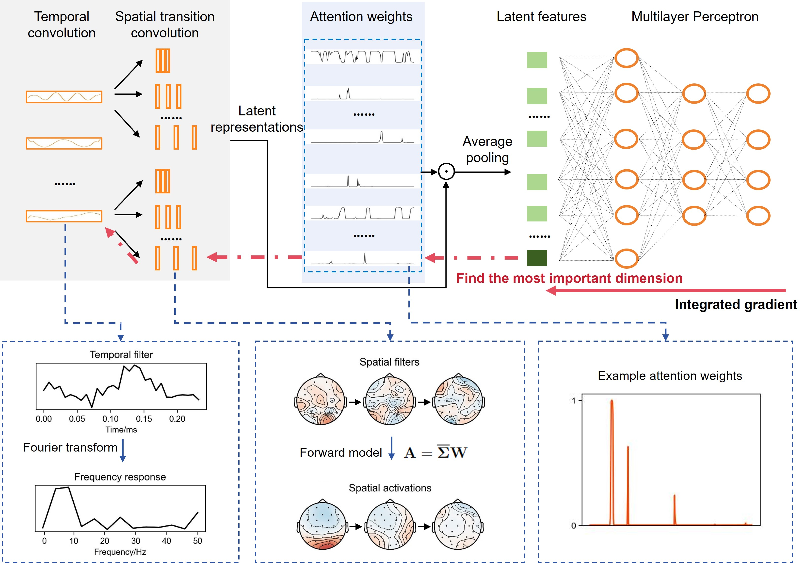

# DAEST

## Table of Contents

- [Main Article](#main-article)
- [Provided Datasets](#provided-datasets)
- [Requirements](#requirements)
  - [Mandatory](#mandatory)
  - [Optional](#optional)
- [Getting Started](#getting-started)

## Main Article

<details>
  <summary>Dynamic-Attention-based EEG State Transition Modeling for Emotion Recognition</summary>
  Electroencephalogram (EEG)-based emotion decoding can objectively quantify people's emotional state and has broad application prospects in human-computer interaction and early detection of emotional disorders. Recently emerging deep learning architectures have significantly improved the performance of EEG emotion decoding. However, existing methods still fall short of fully capturing the complex spatiotemporal dynamics of neural signals, which are crucial for representing emotion processing. This study proposes a Dynamic-Attention-based EEG State Transition (DAEST) modeling method to characterize EEG spatiotemporal dynamics. The model extracts spatiotemporal components of EEG that represent multiple parallel neural processes and estimates dynamic attention weights on these components to capture transitions in brain states. The model is optimized within a contrastive learning framework for cross-subject emotion recognition. The proposed method achieved state-of-the-art performance on three publicly available datasets: FACED, SEED, and SEED-V. It achieved $75.4\pm5.5\%$ accuracy in the binary classification of positive and negative emotions and $59.3\pm7.7\%$ in nine-class discrete emotion classification on the FACED dataset, $88.1\pm3.6\%$ in the three-class classification of positive, negative, and neutral emotions on the SEED dataset, and $73.6\pm12.7\%$ in five-class discrete emotion classification on the SEED-V dataset. The learned EEG spatiotemporal patterns and dynamic transition properties offer valuable insights into neural dynamics underlying emotion processing.

  


</details>

## Provided Datasets

- [SEED/SEEDV](https://bcmi.sjtu.edu.cn/~seed/seed-v.html)
- [FACED](https://www.synapse.org/Synapse:syn50614194/wiki/620378)
## Requirements

### Mandatory

| Package          | Minimum | Recommended |
|------------------|---------|-------------|
| python           | 3.8.0   | 3.12.0      |
| numpy            | 1.21.0  | 1.23.0      |
| hydra-core       | 1.3.0   | 1.3.0       |
| omegaconf        | 2.3.0   | 2.3.0       |
| torch            | 2.0.0   | 2.5.0       |
| pytorch-lightning| 2.0.0   | 2.4.0       |
| wandb            | 0.18.0  | 0.18.6      |
| mne              | 1.8.0   | 1.8.0       |
| h5py             | 3.3.0   | 3.12.1      |
| hdf5storage      | 0.1.19  | 0.1.19      |


### Optional

| Package     | Minimum | Recommended |
|-------------|---------|-------------|
| CUDA        | 11.6    | 12.1        |
| transformers| 4.21.0  | 4.46.2      |

### Hardware

- **Recommended Operating System:** Linux
- **Recommended GPU:** NVIDIA RTX 4090(you can use you own gpu/cpu for sure)

## Getting Started

1. **Clone the Repository:**

    ```bash
    git clone https://github.com/RunminGan1218/DAEST.git
    ```

2. **Navigate to the Project Directory:**

    ```bash
    cd DAEST
    ```

3. **Create your conda environment and install dependencies:**

    ```bash
    conda create -n DASET python==3.12.0
    pip install -r requirements.txt
    ```

4. **Run the Project:**

    you should first config the cfg files in cfg folder follow annotations.
    To summarize, configure relevant data, read-write paths, model config and training setting. 

    then you can simply run the .sh file example in scripts folder
    ```bash
    bash run_model.sh
    ```

    alternatively, you can run the following three Python files one by one after configuring cfg files
    1. run train_ext.py  for pretrain 
    2. run extract_fea.py   for running norm lds save
    3. run train_mlp.py   for finetune

4. **use wandb to see results**

5. **caution:**
    To ensure code security, please ensure that the same run_no is used when running three code files within a trial.
